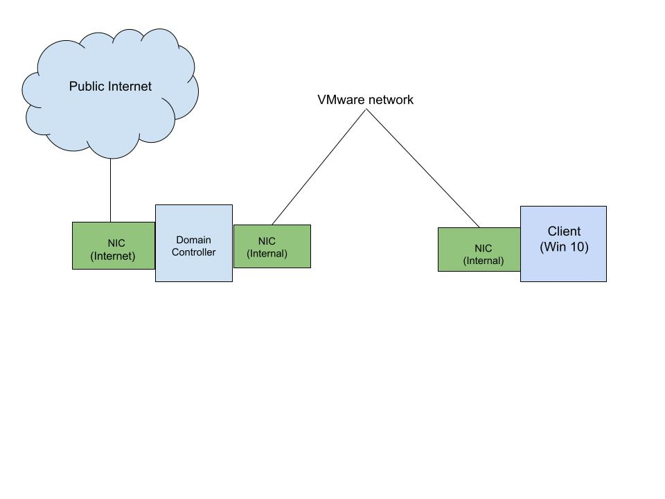

# Active Directory Lab

This project demonstrates the setup and administration of a local Active Directory environment using Windows Server and Oracle VirtualBox.

The lab simulates a small enterprise network with centralized identity and authentication.

## Walkthrough Video

https://www.loom.com/share/f8846b632b0943d2b2d484ebd0f6e1e9

## Project Architecture

This diagram illustrates the lab’s networking setup, including the Windows Server domain controller, the Windows 10 client, and the virtualized internal network with NAT providing internet access. It demonstrates a foundational corporate-style network with centralized identity and authentication.

## Technologies Used
- Windows Server (Active Directory Domain Services)
- Windows 10 Client VM
- Oracle VirtualBox
- PowerShell ISE

## Key Skills Demonstrated
- Active Directory configuration and management
- Domain controller deployment
- User account creation and management
- Domain-joined client configuration
- Authentication fundamentals
- Basic PowerShell usage

## Lab Overview
- Deployed a Windows Server domain controller
- Installed and configured Active Directory Domain Services (AD DS)
- Created domain user accounts
- Joined a Windows 10 client machine to the domain
- Verified successful domain authentication

