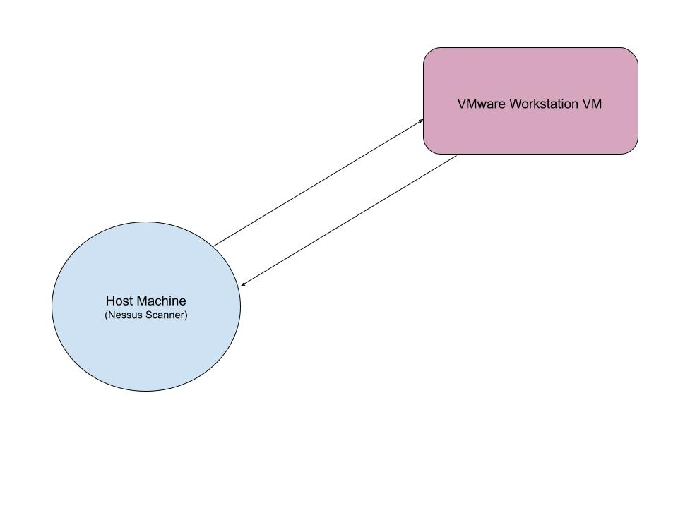

# Vulnerability Management Lab

This project demonstrates the fundamentals of vulnerability management, including vulnerability scanning, analysis, and remediation within a controlled lab environment.

## Walkthrough Video
https://www.loom.com/share/236bdfe27dd8406f83f33cca37a2f0bb

## Project Architecture
This diagram shows a vulnerability management lab where a Nessus scanner assesses a Windows client system over a virtualized NAT network. The scanner performs credentialed scans to identify system vulnerabilities, followed by remediation actions and validation scans to confirm risk reduction.

## Technologies Used
- Nessus Essentials Vulnerability Scanner
- VMware Workstation Windows Virtual Machine
- Virtualized Lab Environment

## Key Skills Demonstrated
- Vulnerability assessment fundamentals
- Risk identification and prioritization
- Interpreting vulnerability scan results
- Basic remediation techniques

## Lab Overview
- Deployed vulnerable target system
- Performed baseline and credentialed vulnerability scans
- Applied remediation steps
- Validated remediation through rescanning
